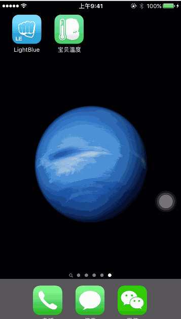
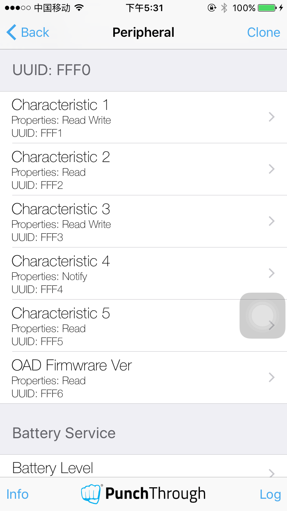

# SDBluetooth 
iOS蓝牙开发
本Demo，梳理了iOS蓝牙设备在和iPhone之间的数据交互。
关于Corebluetooth的知识，网上很多,就不多叙述了。看下面的效果：

测量过程

lightBlue APP,可以模拟设备连接,通过该app可以看到设备的services，对设备的uuid和characteristic有全面的了解

可以看到每个UUID的characteristic中的属性,有可读(Read)，可读写(Read Write),监听(Notify)
